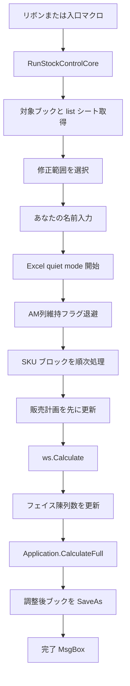

# 設計書 在庫自動調整マクロ

作成日: 2026-05-07
更新日: 2026-07-12

対象: `src/src.xlsm`、配布用 `releases/在庫自動調整.xlam`、`src/vba/mod*.bas`、および `src/ribbon/customUI14.xml`

## 1. 全体構成

本マクロは、コードの正本を `src/vba/mod*.bas` として管理し、編集元ブック `src/src.xlsm` と配布用 Excel アドイン `releases/在庫自動調整.xlam` へ取り込んで提供する。取り込み手順は `docs/開発ガイド.md` と `tools/sync_vba_to_books.ps1` を参照。

リボン上のボタンから各処理を呼び出し、実処理は標準モジュールへ分割している。

## 2. モジュール構成

| モジュール | 主な責務 |
| --- | --- |
| `modRibbonCallbacks` | リボンボタンから各処理を呼び出す |
| `modStockControl` | 自動調整モードの入口 |
| `modManualMode` | 手動調整・HB食品用調整モードの入口、入力値検証 |
| `modStockEngine` | 自動調整・手動調整・HB食品用調整の共通エンジン |
| `modCalculations` | 販売計画、フェイス陳列数、フェイス陳列数上下限、対象判定の計算 |
| `modCommon` | 共通定数、対象ブック取得、Excel状態管理、変更記録 |
| `modPrompts` | あなたの名前入力（デパ名からの既定値生成を含む）、修正範囲確認などの入力・確認ダイアログ |
| `modStorageFolders` | 調整後ブック・履歴ブック保存先の決定（いずれも Downloads 固定）、フォルダピッカー初期位置 |
| `modFileSave` | 履歴ブック保存、調整後ブック保存、ファイル名生成 |
| `modKeepFaceFlag` | AM列フェイス維持フラグ退避（自動調整・手動調整・HB食品用調整の前処理として実行） |
| `modPdfExport` | 選択範囲の A4片面 PDF 出力 |
| `modResetIntention` | 列単位脱色、局所脱色、変更フラグ整理、再エクスポート時の再着色フラグ削除 |
| `modSettings` | アドイン内設定の読み書き（履歴保存先の Downloads 固定化により現在は未使用の汎用基盤） |
| `modDebug` | エラー報告、debug_log 出力、コンパイル確認用 smoke test |

`modSettings` の設定検索は、Excel の前回検索状態に影響されないよう `Find` の検索方向、検索順、大小文字区別、検索書式を明示して呼び出す。

## 3. リボン設計

`customUI14.xml` でリボンタブとボタンを定義する。

各ボタンは `modRibbonCallbacks` の Public Sub を `onAction` として呼び出す。

| ボタンの役割 | 呼び出し先 |
| --- | --- |
| 自動調整 | `RunStockAdjustFromRibbon` |
| 手動調整 | `RunManualAdjustFromRibbon` |
| HB食品用調整 | `RunHbFoodAdjustFromRibbon` |
| 列単位脱色 | `RunResetIntentionFromRibbon` |
| 局所脱色 | `RunResetSelectedCellsFromRibbon` |
| 選択範囲PDF出力 | `RunExportSelectionPdfFromRibbon` |

AM維持フラグ退避の単独ボタンは置かない。AM列維持フラグの退避は、自動調整・手動調整・HB食品用調整の前処理として既定で実行され、各ボタンの `supertip` にその旨を明記する。
HB食品用調整のボタンは `label="HB&#xA;食品用"` の2行表示とし、`supertip` に店型2陳列数(本部推奨)を使用しない旨を明記する。
列単位脱色と局所脱色はいずれも既定の `imageMso="TableEraser"` を使い、アドイン内に画像ファイルを埋め込まない。
選択範囲PDF出力は `imageMso="FileSaveAsPdfOrXps"` を使い、PDF保存を連想できる図柄にする。

## 4. 共通データ設計

### 4.1 対象ブック

対象ブックは `ActiveWorkbook` とする。

ただし、アドイン自身 `ThisWorkbook` は対象外とする。

### 4.2 対象シート

対象シート名は `list` とする。

変更フラグシートは `change_flag_sheet` とする。このシートは必須であり、存在しない場合は処理を中止する。

調整前データシートは `change_bf_data` とする。

### 4.3 商品ブロック

商品は 22 行単位で処理する。

開始行は 8 行目とし、F列が空になった商品ブロックで処理を終了する。

### 4.4 対象列

対象列は、手動調整・既定処理用の `TargetCols()` と、自動調整用の `AutoTargetCols()` で管理する。

現在の実装は以下である。自動調整は2週間分として `Z` 列と `AA` 列を処理し、手動調整・HB食品用調整は従来どおり `Z` 列のみを処理する。

```vb
TargetCols = Array("Z")
AutoTargetCols = Array("Z", "AA")
```

脱色可能列は在庫調整対象列とは別に、`RESET_ALLOWED_START_COL_NO` と `RESET_ALLOWED_END_COL_NO` で管理する。

```vb
Public Const RESET_ALLOWED_START_COL_NO As Long = 26  ' Z
Public Const RESET_ALLOWED_END_COL_NO As Long = 37    ' AK
```

### 4.5 フェイス陳列数上限・下限

販売計画行を `planRow` とした場合、フェイス陳列数に関する共通用語は以下の値を指す。

| 用語 | 実装上の参照位置 | 補足 |
| --- | --- | --- |
| フェイス陳列数上限 | `planRow + FACE_UPPER_OFFSET`、現在は `planRow + 6` | 空白または 0 の場合は `MAX_COUNT`、現在は `300` を使う |
| フェイス陳列数下限 | `planRow + DISP_LOWER_OFFSET`、現在は `planRow + 7` | シート上にあるフェイス陳列数の下限値 |
| 運用側最下限 | `minVal` | 自動調整は `5`、手動調整は操作者入力値 |

本書で「フェイス陳列数上限」と書く場合は、常に上表の値を指す。

## 5. 在庫調整処理の流れ

自動調整・手動調整・HB食品用調整は、入口だけを分け、共通処理 `RunStockControlCore` へ集約する。

`RunStockControlCore` は省略可能引数 `useStoreType2`（既定 `True`）を持つ。HB食品用調整の入口（`modManualMode.在庫HB食品用調整実行` → `RunManualAdjustmentFlow`）だけが `False` を渡し、店型2陳列数(本部推奨)を加算にも販売予定なし判定にも使わない。



AM列維持フラグの退避は、SKU ブロック処理の前に既定で実行する。履歴保存先が確定しない場合は、値を書き換えずに処理全体を中止する。詳細は 15 章に示す。

直近3週の販売計画行と実績行がすべて 0 の新商品相当は、過去実績倍率を使えないため SKU ブロックごと一切触らない。

本部推奨フェイス1と本部推奨フェイス2がどちらも 0 の対象週は、販売予定なしとして販売計画更新、通常フェイス計算、既存フェイスの上下限補正をすべてスキップする。対象列がすべて販売予定なしの場合は、直近実績倍率の計算も行わず SKU ブロックごとスキップする。

HB食品用調整（`useStoreType2 = False`）の販売予定なし判定は本部推奨フェイス1のみで行い、本部推奨フェイス1が 0 の対象週は店型2陳列数(本部推奨)に数値があってもスキップする。実装は `IsNoSalesPlanWeek` / `HasAnySalesPlanTargetWeek` の省略可能引数 `includeStoreType2` で切り替える。

## 6. 修正範囲選択設計

`RunStockControlCore` から `modPrompts.ConfirmAdjustmentScope` を呼び出し、修正範囲を確認する。

使用するボタンは `vbYesNoCancel` とする。

| 戻り値 | 内部変数 | 意味 |
| --- | --- | --- |
| `vbYes` | `includeIntentioned = True` | 全て修正 |
| `vbNo` | `includeIntentioned = False` | 未意思入れ商品のみ修正 |
| `vbCancel` | 処理終了 | 中止 |

`vbDefaultButton1` を付け、初期選択は `はい` 側にする。

## 7. 対象セル書き込み判定

書き込み可否は `CanWriteTargetCell` で判定する。

判定ルールは以下。

```text
数式セルの場合:
  書き換え不可

全て修正の場合:
  数式以外は書き換え可

未意思入れ商品のみ修正の場合:
  通常色、またはマクロ書込済み色のみ書き換え可
```

販売計画の通常色は `PLAN_EDITABLE_COLOR()`、フェイス陳列数の通常色は `FACE_EDITABLE_COLOR()` で管理する。

マクロ書込済み色は `WRITTEN_COLOR()` で管理する。

## 8. 販売計画計算設計

販売計画は以下の順序で計算する。

1. 直近3週の自店実績と本部計画から倍率を計算する。
2. 対象列の本部計画に倍率を掛ける。
3. 正の端数は切り上げる。
4. 販売計画下限と販売計画上限の間に収める。

販売計画上限が販売計画下限を下回る場合は、下限値を優先する。

## 9. フェイス陳列数計算設計

通常調整対象の商品は、以下の条件で判定する。

```text
HqFaceBase(ws, planRow, colNo) > minVal
```

`HqFaceBase` は本部推奨フェイス1のみの値である。店型2陳列数(本部推奨)（本部推奨フェイス2）は、判定にも下限側の寄せ先にも使用せず、最終加算専用とする。

```text
本部推奨フェイス1
```

通常調整対象の場合、フェイス陳列数は以下の順序で計算する。

1. 販売計画更新後に `ws.Calculate` を実行する。
2. 最新の販売計画、フェイス陳列数下限、フェイス陳列数上限を読む。
3. `販売計画 × 目標手持週数` に近い整数を選ぶ。
4. 本部推奨フェイス1と運用側最下限の大小関係から、下限側の寄せ先を決める。
5. 手持週数側の値と寄せ先の大きい方を候補値にする。
6. 店型2陳列数(本部推奨)に数値が入っている場合は、その数値をそのまま候補値へ加算する（HB食品用調整では加算しない）。
7. 最後にシート上のフェイス陳列数下限・フェイス陳列数上限の範囲内に収める。
8. 値が変わる場合のみ書き込む。

店型2陳列数(本部推奨)は、マクロが入力するフェイス陳列数行の1行上、`planRow + FACE_HQ_2_OFFSET`（現在は `planRow + 13`）にある本部推奨フェイス2行を指す。実装関数は `GetStoreType2FaceAddition` とし、空白・数値以外・0以下の場合は加算しない。加算の有無は `GetPriorityFaceQty` / `AdjustFaceForLowHqIfNeeded` の省略可能引数 `addStoreType2`（既定 `True`）で切り替え、HB食品用調整だけが `False` で実行する。

## 10. フェイス調整優先順位設計

フェイス陳列数の実装関数は `GetPriorityFaceQty` とする。優先順位は以下。

```text
MDシステム取込用のシート上下限 clamp
>
手持週数から見た必要フェイス数
>
運用側下限値・本部推奨フェイス1の大小関係
```

本部推奨フェイス1が 0 より大きく指定下限値以下の場合の書き込み実行関数は `AdjustFaceForLowHqIfNeeded` とする。

### 10.1 判定式

本部推奨フェイス1と指定下限値の関係から、下限側の寄せ先 `relationFloor` を決める。

```text
if 本部推奨フェイス1 > 指定下限値 then
    relationFloor = 指定下限値
else if 本部推奨フェイス1 > 0 then
    relationFloor = CeilToLong(本部推奨フェイス1)
else
    relationFloor = 0
end if
```

対象週の本部推奨フェイス1と本部推奨フェイス2がどちらも 0 の場合は、販売予定なしとしてこの処理も行わない（HB食品用調整では本部推奨フェイス1のみで判定する）。

本部推奨フェイス1が 0 で店型2陳列数(本部推奨)だけに数値がある週（通常モードのみ到達する）は、`AdjustFaceForLowHqIfNeeded` による戻しや店型2加算を行わず、`ClampExistingFaceIfNeeded` によるシート上下限補正だけを行う。

操作者の表現に合わせると、関係だけで見た下限側の寄せ先は次のとおり。

| 条件 | 下限側の寄せ先 |
| --- | --- |
| 本部推奨フェイス1 > 指定下限値 > 既存フェイス陳列数 | 指定下限値 |
| 本部推奨フェイス1 > 既存フェイス陳列数 > 指定下限値 | 指定下限値 |
| 既存フェイス陳列数 > 本部推奨フェイス1 > 指定下限値 | 指定下限値 |
| 指定下限値 > 既存フェイス陳列数 > 本部推奨フェイス1 | 本部推奨値 |
| 既存フェイス陳列数 > 指定下限値 > 本部推奨フェイス1 | 本部推奨値 |
| 指定下限値 > 本部推奨フェイス1 > 既存フェイス陳列数 | 本部推奨値 |

この関係は 5、4、3 の固定値ではなく、変数 `minVal`、`hqFace`、`currentVal` の大小比較で行う。

### 10.2 調整値

調整値は以下で決める。手持週数側の値は、まずシート上下限だけで計算し、運用側下限値はまだ混ぜない。

```text
handWeeksVal = GetBestFaceQty(販売計画, シート下限, シート上限, minVal:=0, targetWeeks)
candidateVal = Max(handWeeksVal, relationFloor) + 店型2加算
targetVal = ClampFaceValueToSheetLimits(candidateVal)
```

店型2加算は `GetStoreType2FaceAddition` の戻り値で、店型2陳列数(本部推奨)（`planRow + 13`）に数値が入っている場合だけ、その数値をそのまま使う（半分等の換算は行わない）。HB食品用調整（`addStoreType2 = False`）では店型2加算を 0 とする。MDシステム取込エラーを避けるため、加算後も最後のシート上下限 clamp は必ず通す。

このため、売れ筋商品で `handWeeksVal` が大きい場合は、運用側下限値や本部推奨値へ機械的に下げず、手持週数側の値を優先する。

MDシステム取込エラーを避けるため、`ClampFaceValueToSheetLimits` はどの調整経路でも最後に必ず通す。

### 10.3 書き込み条件

以下の場合は調整処理を行わない。

- 対象セルが数式である。
- 既存値が数値でない。
- 本部推奨フェイス1が 0 以下である。
- シート上下限で収めた後の値が既存フェイス陳列数と同じである。
- 修正範囲の選択により、そのセルが書き込み不可と判定された。

## 11. 意思入れ済みセルのフェイス陳列数上下限補正

`未意思入れ商品のみ修正` の場合、通常はオレンジ色の意思入れ済みセルを書き換えない。

ただし、フェイス陳列数がシート上のフェイス陳列数下限・フェイス陳列数上限の範囲外にある場合は、MDシステム取込エラーを避けるため `ClampExistingFaceIfNeeded` で範囲内へ補正する。この補正は本部推奨フェイス1と運用側下限値の大小関係に関係なく、販売予定のある週すべてに適用する（`RunStockControlCore` の通常調整ルートと本部推奨優先ルートの両方から呼ばれる）。補正には運用側下限値を混ぜない。販売予定なしの週と新商品相当の商品は、販売計画更新、通常フェイス計算、上下限補正のすべてを行わない。

この補正は、販売計画を書き換えた後の `ws.Calculate` 後に行う。

## 12. 変更記録設計

値の書き込みは `WriteIfChanged` に集約する。

処理内容は以下。

1. 値が変わるか確認する。
2. 値が変わらない場合は何もしない。
3. 値を書き込む。
4. セル色を `WRITTEN_COLOR()` にする。
5. `MarkChanged` を呼び出す。

`MarkChanged` は以下を行う。

- `list` シートの B 列に `V` を入れる。
- `change_flag_sheet` の対象セル位置に `V` を入れる。

## 13. 保存設計

調整完了後、`SaveAdjustedWorkbookWithName` で対象ブックを保存する。

保存処理の流れは以下。

1. あなたの名前を取得する（既定値の設計は 13.1 参照）。
2. 保存フォルダを決める（`ResolveAdjustedWorkbookSaveFolder`、13.2 参照）。
3. 日付、商品名4文字、あなたの名前、週数、下限値をこの順で含むベースファイル名を作る。
4. 同じ保存名のファイルが既にある場合は、旧ファイルを削除する。`_2`、`_3` などの連番は付けない。
5. `SaveAs` で保存する。
6. 保存成功後、元ファイルと保存先が異なる場合は元ファイル削除を試みる。ただし削除は `IsSafeOriginalDeleteLocation` が真の場合（Downloads・TEMP/TMP・ブラウザキャッシュ配下。UNC パスは対象外）に限り、それ以外の原本は削除せず保持して完了メッセージへ表示する。

自動調整・手動調整・HB食品用調整のいずれも、ファイル名上では `1.9週_下限値5` のように目標手持週数と運用側最下限値を付ける。自動調整では標準値の `2.0週_下限値5` を付け、最後に `_2週間分` を付ける。HB食品用調整の保存名は手動調整と同形式とし、専用の接尾辞は付けない。

`BuildAdjustedWorkbookBaseName` の生成順は以下とする。

```text
mmdd + 商品名4文字 + 入力された名前 + "_" + X.X週 + "_下限値" + N
```

`includeIntentioned = False`、つまり未意思入れ商品のみ修正の場合だけ、`_未意思入のみ` を付ける。

```text
mmdd + 商品名4文字 + 入力された名前 + "_" + X.X週 + "_下限値" + N + "_未意思入のみ"
```

例: `0520コミュニ山田_1.9週_下限値5_未意思入のみ.xlsx`

自動調整の場合は、未意思入れ商品のみ修正の suffix より後ろに `_2週間分` を付け、ファイル名の最後が `_2週間分` になるようにする。

```text
mmdd + 商品名4文字 + 入力された名前 + "_2.0週_下限値5" + ["_未意思入のみ"] + "_2週間分"
```

商品名部分は `GetListNamePartForAdjustedWorkbook` から取得する。D列の文字列は `GetKeepFaceHistoryNamePart` でコロンの右側を取り出し、先頭4文字だけに丸める。例: `067:コミュニケーショ` -> `コミュニ`

コロン右側の取り出しは `modFileSave.GetTextAfterColon` に共通化する。半角コロンと全角コロンの早い方で区切り、コロンが無い場合は全体を返す。商品名部分（4文字）と、あなたの名前の既定値（3文字、13.1 参照）の両方がこの関数を使う。

### 13.1 あなたの名前の既定値

`modPrompts.PromptOperatorName` は `list` シートの参照を受け取り、既定値を `modPrompts.BuildDefaultOperatorName` で作る。

- `list` シートの C6（`OPERATOR_DEPT_COL` / `OPERATOR_DEPT_START_ROW`）から下へ向かって、半角または全角コロンを含む最初のセルをデパ名として使い、`GetTextAfterColon` で名称を取り出す。コロンを含まないセル（メモ、数値など）は採用しない。
- 取り出した名称の先頭3文字（`OPERATOR_NAME_CHAR_COUNT`）に `担当`（`OPERATOR_NAME_SUFFIX`）を付ける。例: `110:ファニチャー` → `ファニ担当`
- 名称が3文字未満の場合は、その全体に `担当` を付ける。
- コロンを含むセルが見つからない場合は空文字を返し、`PromptOperatorName` が `Application.UserName` を既定値に使う。

既定値は InputBox の初期値であり、操作者は自由に書き換えられる。空欄のままでは先へ進めない仕様は従来どおりとする。

### 13.2 調整後ブックの保存先

調整後ブックの保存先は `modStorageFolders.ResolveAdjustedWorkbookSaveFolder` で決める。

- 操作PCの Downloads フォルダ（`GetDefaultDownloadFolder`）が存在すれば、常にそこへ保存する。元ブックのフォルダ（`wb.Path`）は使わない。ブラウザからダウンロードして直接開いたブックでは `wb.Path` がキャッシュ等の分かりにくい場所を指し、MDシステムへの取込時に調整後ブックを見失うためである。
- `GetDefaultDownloadFolder` は、ブラウザの保存先と一致させるため Windows の既知フォルダ設定（`Shell.Application` の `shell:Downloads`）を最優先で解決し、解決できない場合のみ `%USERPROFILE%\Downloads` 等の従来ロジックへフォールバックする。Downloads を移動しているPCでも移動先へ保存される。
- Downloads が見つからないPCに限り、`PickAdjustedWorkbookSaveFolder` のフォルダ選択ダイアログへ切り替える（この状況では Downloads を解決できないため、ダイアログの初期位置は Excel の既定に従う）。

調整後ブックの保存は必須である。フォルダ選択ダイアログでキャンセルされた場合は選び直しを促し、保存先が確定しなければ `SaveAdjustedWorkbookWithName` がエラーとして扱う。これにより、未保存のまま完了 MsgBox を出さない。

完了 MsgBox には以下を表示する。

- 販売計画修正数
- フェイス陳列修正数
- 修正対象商品
- 手持週数
- 運用側最下限値
- 保存名
- 元ファイル削除結果
- AM維持フラグ退避結果

修正対象商品には、`scopeLabel` の値を表示する。

完了 MsgBox には、数値修正後の元ファイルバックアップ情報は表示しない。

## 14. バックアップ方針

在庫自動調整・在庫手動調整の実行時には、セルを書き換える前の `SaveCopyAs` バックアップを作成しない。

`.bas`、設計書、アドイン本体の編集や取り込みなど、設計段階・運用前段階の作業では、作業者が `マクロセッティング_バックアップ` 配下などへバックアップを取得してから作業する。

## 15. AM列フェイス維持フラグ退避設計

AM列維持フラグの退避は、単独ボタンではなく、自動調整・手動調整・HB食品用調整の前処理として `RunStockControlCore` から既定で実行する。実装関数は `modKeepFaceFlag.ExecuteKeepFaceFlagEvacuation` とする。

AM列のフェイス陳列数行にある `2` を処理する。処理の順序は以下。

1. 対象セルを収集する。
2. 対象 JAN を履歴配列へ保持する。
3. 履歴ブック保存先を決める。
4. 履歴ブックへ JAN を保存する。
5. 保存成功後、対象セルを空白化する。
6. セル色と変更フラグを更新する。

対象の `2` が1件もない場合は、履歴ブックを作らず退避結果を「対象なし」として先へ進む。

履歴ブックの保存先は `modStorageFolders.ResolveKeepFaceHistoryFolder` で決める。調整後ブック（13.2 参照）と同じく操作PCの Downloads フォルダ（`GetDefaultDownloadFolder`）に固定し、確認ダイアログは表示しない。Downloads が見つからないPCに限り、`PickKeepFaceHistoryFolder` のフォルダ選択ダイアログへ切り替える。前回保存先の再利用（setting シート）は行わない。保存先が確定しなかった場合、`ExecuteKeepFaceFlagEvacuation` は False を返し、呼び出し側は値を一切書き換えずに調整処理全体を中止する。

退避の実行結果（消去件数、履歴保存件数、保存先など）は、単独の MsgBox ではなく調整完了 MsgBox の「AM維持フラグ退避」行に表示する。

履歴ブックは日単位で作成し、既存ファイルがある場合は追記する。

保存時は、履歴ブック内の既存 JAN を読み込み、同じ JAN は追記しない。同一実行内で同じ JAN が複数回出た場合も1件だけ保存する。既存履歴ブック内に重複 JAN 行がある場合は、先に出ている1行を残して後続の重複行を削除する。

## 16. 選択範囲PDF出力設計

`選択範囲PDF出力` は、選択中のセル範囲を A4片面（A4用紙1ページ）に収めて PDF ファイルへ保存する。実装モジュールは `modPdfExport`、入口は `選択範囲PDF出力` とする。

処理の順序は以下。

1. 選択がセル範囲であることを確認する。範囲以外の選択や、離れた複数範囲の選択は対象外として中止する。
2. 保存先とファイル名を `Application.GetSaveAsFilename` で指定してもらう。初期位置は操作PCの Downloads フォルダ、初期ファイル名は `mmdd_シート名_選択範囲.pdf` とする。
3. 対象シートの印刷設定（用紙サイズ、拡大縮小、ページに合わせる設定）を退避してから、A4・横1ページ×縦1ページへ一時変更する。用紙の向きは変更せず、シートの設定を使う。
4. `Range.ExportAsFixedFormat Type:=xlTypePDF` で選択範囲だけを出力し、出力後に PDF を開く。
5. 成功・エラーのどちらでも、対象シートの印刷設定を実行前の状態へ戻す。

## 17. 脱色設計

`列単位脱色` は、指定した開始列から終了列まで、販売計画行とフェイス陳列数行の色と変更フラグを通常状態に戻す。指定できる列は `Z` 列から `AK` 列までとし、範囲外が指定された場合は処理しない。

値そのものは変更しない。

処理対象は、販売計画行とフェイス陳列数行のみとする。

`局所脱色` は、`list` シートで現在選択されているセルだけを対象にする。`Z` 列から `AK` 列までにある選択セルだけを脱色し、範囲外の選択セルは対象外として数える。

選択セルごとに行位置を判定し、商品ブロック開始行からの相対位置が `0` の場合は販売計画行として `PLAN_EDITABLE_COLOR()` へ戻す。相対位置が `STOCKROW_OFFSET` の場合はフェイス陳列数行として `FACE_EDITABLE_COLOR()` へ戻す。

対象セルは `ResetColorOneCell` で `list` と `change_bf_data` の色を戻し、`change_flag_sheet` の同一セル位置のフラグを消す。処理後に同じ行のフラグが残っていない場合は、`list` シート B 列の変更印も消す。

在庫管理ブックに搭載されている起動マクロは、対象列から15列右のセルにある `1` / `2` を見て、再エクスポート後のブックを再着色する。そのため `ResetColorOneCell` は `ClearReexportColorFlag` も呼び、同じ行の `対象列 + REEXPORT_COLOR_FLAG_COL_OFFSET` にある `1` / `2` を消す。

販売計画行・フェイス陳列数行以外の選択セルは対象外として数え、値も色も変更しない。

## 18. エラー処理設計

各入口処理は `On Error GoTo EH` を持つ。

エラー発生時は `ReportMacroError` に以下を渡す。

- 処理名
- 処理段階
- エラー番号
- エラー内容
- 対象ブック
- 対象シート
- 販売計画行
- フェイス陳列数行
- 対象列

`ReportMacroError` は MsgBox 表示、`Debug.Print`、`debug_log` シート追記を行う。

## 19. Excel状態管理

大量更新中は `BeginApplicationQuietMode` を呼び、以下を一時停止する。

- `Application.EnableEvents`
- `Application.ScreenUpdating`
- `Application.Calculation`

処理終了時またはエラー時は `RestoreApplicationState` で復元する。

## 20. 文字コード設計

VBE へ取り込む `src/vba/mod*.bas` は Shift-JIS（CP932）+ CRLF で保存する。改行は `.gitattributes` の `*.bas text eol=crlf` で固定する。

各 `.bas` には `Attribute VB_Name = "モジュール名"` を付け、VBE 取り込み時に `Module1` などの仮名にならないようにする。

## 21. 検証観点

最低限、以下を確認する。

- `DebugCompileSmokeTest` が `True` を返す。
- `src.xlsm` と配布用 `releases/在庫自動調整.xlam` 内に対象モジュールが正式名で存在する。
- 本部推奨フェイス2行がどちらも 0 の対象週では、販売計画・フェイス陳列数・上下限補正が一切走らない。
- 調整対象の判定・下限側の寄せ先が本部推奨フェイス1のみで行われる（店型2陳列数は判定に影響しない）。
- 本部推奨フェイス1が指定下限値より大きい場合、下限側の寄せ先は指定下限値になる。
- 指定下限値が本部推奨フェイス1より大きい場合、下限側の寄せ先は本部推奨値になる。
- 手持週数側の必要フェイス数が寄せ先より大きい場合、手持週数側の値を優先する。
- フェイス陳列数の実書き込み値は、常にシート上のフェイス陳列数下限・上限内に収まる。
- 自動調整では `Z` 列と `AA` 列の2週間分を修正対象にする。
- 自動調整・手動調整・HB食品用調整の修正範囲選択が同じ意味で表示される。
- 自動調整・手動調整・HB食品用調整の保存名が `mmdd商品名4文字入力名_X.X週_下限値N` の順序になる。
- 調整後ブックが操作PCの Downloads フォルダへ保存される（元ブックのフォルダには保存されない）。
- Downloads を既定以外へ移動しているPCでも、ブラウザと同じダウンロード先へ保存される（既知フォルダ解決）。
- 元ファイルが Downloads・一時フォルダ・ブラウザキャッシュ以外（共有フォルダ等）にある場合、原本が削除されず保持される。
- あなたの名前入力の既定値が、`list` シート C6 以下のデパ名から「コロン右3文字＋担当」になる（例: `110:ファニチャー` → `ファニ担当`）。
- C6 以下にコロンを含むセルが無い場合、あなたの名前入力の既定値が Excel のユーザー名になる（コロン無しの文字列は採用されない）。
- 未意思入れ商品のみ修正の場合だけ、保存名に `_未意思入のみ` が入る。
- 自動調整の保存名は最後に `_2週間分` が入る。
- 同じ保存名の旧ファイルがある場合は削除し、連番付きファイル名を作らない。
- D列のコロン右側から先頭4文字だけが保存名に入る。
- 局所脱色で販売計画行は販売計画用基本色、フェイス陳列数行はフェイス用基本色へ戻る。
- 脱色可能列は `Z` 列から `AK` 列までに限定される。
- 列単位脱色・局所脱色で再エクスポート時の再着色フラグが消える。
- `未意思入れ商品のみ修正` でオレンジ色セルが原則保護される。
- 自動調整・手動調整・HB食品用調整の実行時に、AM列維持フラグの退避が SKU 処理の前に既定で実行される。
- AM維持フラグ履歴ブックが、ダイアログなしで操作PCの Downloads フォルダへ保存される。
- Downloads に同名の履歴ブックがある場合、新規作成ではなくそのブックへ追記・重複整理される。
- AM維持フラグ履歴の保存先が確定しない場合、値を一切書き換えずに処理を中止する。
- AM維持フラグ退避の結果が、調整完了 MsgBox に表示される。
- 店型2陳列数(本部推奨)に数値が入っている列は、フェイス陳列数へその数値がそのまま加算される（半分にならない）。
- 店型2陳列数(本部推奨)が空白または 0 の列は、加算なしの従来計算と同じ値になる。
- 店型2加算後も、実書き込み値はシート上のフェイス陳列数下限・上限内に収まる。
- 通常モードで本部推奨フェイス1が 0・店型2陳列数(本部推奨)のみ数値の週は、計算・加算されず、シート上下限から外れた既存値だけが補正される。
- HB食品用調整では、店型2陳列数(本部推奨)に数値があってもフェイス陳列数へ加算されない。
- HB食品用調整では、本部推奨フェイス1が 0 の対象週は店型2陳列数(本部推奨)に数値があっても販売予定なしとしてスキップされる。
- HB食品用調整の保存名が手動調整と同形式になり、専用の接尾辞が付かない。
- 選択範囲PDF出力で、選択した範囲だけが A4 1ページに収まった PDF として保存される。
- 選択範囲PDF出力の実行後、対象シートの印刷設定が実行前の状態へ戻る。
- MsgBox が内容ごとに改行され、長文になりすぎていない。
